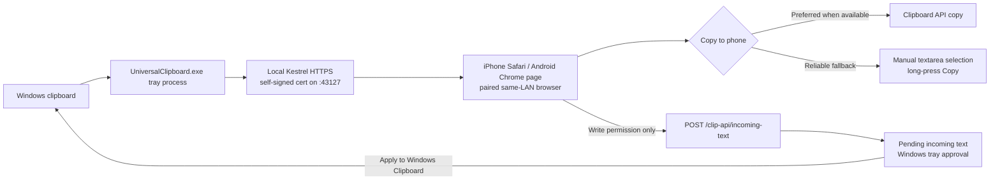

# Universal Clipboard

Universal Clipboard is a personal Windows-to-mobile text bridge for iPhone Safari
and Android Chrome. Copy plain text on Windows, open the paired local page on the
phone, tap the copy button, then paste in another mobile app. Write-enabled
pairings can also send text from iPhone Safari or Android Chrome back to Windows,
where it stays pending until you click **Apply to Windows Clipboard** in the tray.

This MVP is intentionally local-first:

- no account;
- no cloud relay;
- no mobile app;
- no clipboard payloads written by the app to disk;
- latest three approved text items only.

## Quick Start

Download `UniversalClipboard-win-x64.zip` from the latest release or Windows build
artifact, extract it, then run:

```powershell
.\UniversalClipboard.exe
```

The zip also includes `UniversalClipboard-win-x64.sha256` for release checksum
verification.

Windows management stays in the **Tray UI**. Use the tray window to choose the LAN
interface, generate a QR code, and view the phone URL. iPhone Safari or Android
Chrome uses the tray URL, for example `https://<LAN-IP>:43127/`.

On launch, `UniversalClipboard.exe` checks the extracted runtime payload against
its `.deps.json` runtime/native asset manifest, then checks for the required
Private + LocalSubnet Windows Firewall rule and asks for elevation if it needs to
create or repair it. The same network must be Private and TCP port `43127` must be
reachable from the phone. Normal Tray **Exit** removes the app-created firewall
rule. If the phone cannot load the tray URL, use the manual firewall guidance in
[docs/firewall-setup.md](docs/firewall-setup.md).

Scan the tray QR code with iPhone Safari or Android Chrome, accept the self-signed
certificate warning only on a trusted private LAN, and use the paired phone page.

## Requirements

- Windows PC on a trusted **Private** Ethernet or Wi-Fi network.
- iPhone Safari or Android Chrome on the same LAN.
- TCP port `43127` reachable from the phone.
- For source builds, .NET 10 SDK.

The app serves a self-signed HTTPS endpoint on the selected LAN address, for
example `https://192.168.1.5:43127/`. The HTTPS identity is persisted under the
current Windows user profile and protected with Windows DPAPI, so restarting the
app reuses the same certificate for the same selected IPv4 address. The tray shows
the certificate short code and fingerprint, and **Reset HTTPS** deliberately
generates a new identity and revokes pairings.
If the stored identity is missing while pairings exist, corrupt, expired, or bound
to the wrong selected IPv4 address, the app revokes existing pairings before it
serves the replacement certificate.

This encrypts the local transport and helps against passive LAN sniffing, but it
is **not** a complete trust model: there is no private CA or automatic browser
certificate pinning. The first time a mobile browser accepts the self-signed
certificate can still be attacked by an active same-network attacker. Do not use
it on public, guest, hotel, school, or untrusted networks.

## Architecture



More project documentation:

- [Design and security model](docs/design.md)
- [MVP wireframe](docs/ux-wireframe.html)
- [Firewall setup](docs/firewall-setup.md)
- [Release smoke checklist](docs/release-smoke.md)

## Build From Source

```powershell
.\scripts\bootstrap.ps1

$dotnet = '.\.dotnet\dotnet.exe'
& $dotnet restore UniversalClipboard.slnx
& $dotnet build UniversalClipboard.slnx -c Release --no-restore
& $dotnet publish src/UniversalClipboard.App/UniversalClipboard.App.csproj -c Release -r win-x64 --self-contained true -o artifacts/win-x64
Get-FileHash artifacts/win-x64/UniversalClipboard.exe, artifacts/win-x64/UniversalClipboard.dll -Algorithm SHA256 |
    ForEach-Object { "$($_.Hash)  $([System.IO.Path]::GetFileName($_.Path))" } |
    Set-Content artifacts/win-x64/UniversalClipboard-win-x64.sha256 -Encoding ASCII
```

Run:

```powershell
.\artifacts\win-x64\UniversalClipboard.exe
```

Unsigned local builds may trigger Windows SmartScreen. That is expected for this
MVP; verify the source and checksums before running builds you did not create.

For source development, `.\scripts\run.ps1` runs `scripts\bootstrap.ps1`, restores
packages when needed, builds, and starts the tray app. The app can request
elevation to manage its runtime firewall rule. To create the documented Private +
LocalSubnet inbound firewall rule for TCP `43127` before launch, run from
**Administrator PowerShell**:

```powershell
.\scripts\run.ps1 -ConfigureFirewall
```

Tray **Exit** removes the runtime firewall rule during normal shutdown. To remove
the rule manually, run:

```powershell
.\scripts\remove-firewall.ps1
```

## First Setup

1. Set the Windows network profile to **Private**.
2. Extract `UniversalClipboard-win-x64.zip`.
3. Launch `UniversalClipboard.exe`.
4. Approve the Windows elevation prompt if the app needs to create or repair the
   Private + LocalSubnet firewall rule.
5. If multiple eligible LAN interfaces are shown, choose the one on the same network
   as the phone.
6. Choose a pairing duration. The default is **5 hours**.
7. Choose pairing permission. The default is **Read only**. Select **Read + Write**
   before generating the QR code if the phone should both read Windows clips and
   send text back. Select **Write only** only when the phone should submit text but
   not read the Windows feed.
8. Generate a pairing QR code in the tray window.
9. Open or scan the pairing URL on iPhone Safari or Android Chrome.
10. Copy text on Windows. Sensitive-looking text is held for approval in the tray.
11. On the phone, tap **Copy to iPhone**. If the browser does not allow one-tap
    clipboard copy, use the selected textarea and long-press **Copy**.
12. For Write-enabled pairings, use **Send to Windows** on the phone, then approve
    the pending incoming item from the Windows tray.

## Pairing Durations

- **1 hour**: short session for a single task.
- **5 hours**: default work-session duration.
- **1 day**: useful for one-day setup or travel.
- **1 week**: longer trusted-device convenience.
- **Permanent**: server-side authorization does not expire until revoked. This is
  high risk; revoke it when no longer needed. The mobile browser may still delete
  its cookie or site storage.

Every paired browser authorization can read the latest three shared items while it
is valid unless it was paired as **Write only**. New pairings default to **Read
only**. Revoke one browser or revoke all from the tray window.

## Pairing Permissions

- **Read only**: iPhone Safari or Android Chrome can fetch the Windows feed and use
  **Copy to iPhone**. This is the default.
- **Write only**: iPhone Safari or Android Chrome can use **Send to Windows**, but
  it cannot read the Windows feed.
- **Read + Write**: iPhone Safari or Android Chrome can use both directions.
  Incoming text still waits in the tray until you approve it with **Apply to Windows
  Clipboard**.

## Privacy And Security Limits

Clipboard text stays in process memory only. Restarting the Windows app clears
shared, pending, and incoming clipboard content. Authorization metadata is stored under
`%LOCALAPPDATA%\UniversalClipboard\authorizations.v1.bin` and protected with Windows
DPAPI for the current user. The file stores token and session-proof digests, not
plaintext session tokens, session proofs, pairing codes, or clipboard text. The
local HTTPS identity is stored separately under
`%LOCALAPPDATA%\UniversalClipboard\https-certificates.v1.bin` and is also protected
with Windows DPAPI for the current user.

Important limits:

- The MVP uses a persisted self-signed HTTPS certificate per selected IPv4 address.
  This reduces repeated mobile browser warnings and gives the Windows tray a stable
  fingerprint to display, but it is not a full trust model: there is no private CA
  or automatic browser certificate pinning.
- An active same-network attacker may still attack the first certificate acceptance
  flow. Use the app only on trusted Private networks. If the tray identity changes
  unexpectedly, reset HTTPS and pair again only on a network you trust.
- Authorization requires both the host-scoped HttpOnly `clip_session` cookie and an
  independent `X-Clip-Session` proof stored in same-origin browser storage. The web
  page prefers `localStorage` so mobile browser tab reloads keep working, and falls
  back to `sessionStorage` when persistent storage is unavailable. The cookie uses
  `HttpOnly`, `Secure`, `SameSite=Strict`, and `Path=/clip-api`.
- Incoming phone-to-Windows text requires a Write-enabled pairing and is never
  applied automatically. Revoke, revoke all, expiry cleanup, and app exit clear the
  relevant incoming queue.
- Sensitive detection is a guardrail, not data loss prevention. It covers PEM
  private keys, GitHub classic and fine-grained tokens, and AWS `AKIA`/`ASIA`
  access-key identifiers.
- Windows may write process memory to pagefile, hibernation files, or crash dumps.
- A compromised Windows machine, paired browser, or LAN invalidates the trust model.

## Troubleshooting

- **Tray says Public network**: switch the Windows network profile to Private.
- **Phone cannot load the URL**: check same Wi-Fi, guest/client isolation, VPN, and
  Windows Firewall.
- **Firewall shows Unknown**: restart the app and approve elevation so it can
  repair the exact Private + LocalSubnet rule with both `Name` and `DisplayName`
  set to `Universal Clipboard LAN`, or use
  [docs/firewall-setup.md](docs/firewall-setup.md) manually.
- **Port conflict**: another process is listening on TCP `43127`; stop it before
  starting sharing.
- **The mobile browser shows a new certificate warning after it previously worked**:
  confirm the tray HTTPS identity did not change unexpectedly. A new selected IP,
  expired or corrupt local identity, or **Reset HTTPS** creates a new certificate,
  revokes existing pairings, and requires pairing again.
- **Expired or reused QR**: generate a new pairing code. Codes are single-use and
  expire after two minutes.
- **Copy button does not confirm Copied**: use the visible selected text and
  long-press Copy. Manual copy is the reliable browser fallback when one-tap
  Clipboard API access is unavailable.
- **Send to Windows is disabled**: generate a new QR code with **Read + Write** or
  **Write only** selected, then pair the mobile browser again.
  
## Star History

<a href="https://www.star-history.com/?repos=ray910408%2FUniversal_Clipboard&type=date&legend=top-left">
 <picture>
   <source media="(prefers-color-scheme: dark)" srcset="https://api.star-history.com/chart?repos=ray910408/Universal_Clipboard&type=date&theme=dark&legend=top-left" />
   <source media="(prefers-color-scheme: light)" srcset="https://api.star-history.com/chart?repos=ray910408/Universal_Clipboard&type=date&legend=top-left" />
   
 </picture>
</a>
