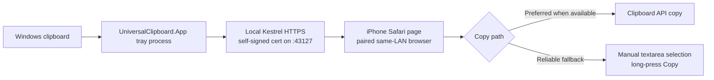

# Universal Clipboard

Universal Clipboard is a personal Windows-to-iPhone text bridge. Copy plain text on
Windows, open the paired local page on iPhone Safari, tap **Copy to iPhone**, then
paste in another iPhone app.

This MVP is intentionally local-first:

- no account;
- no cloud relay;
- no iPhone app;
- no clipboard payloads written by the app to disk;
- latest three approved text items only.

## Quick Start

From a Windows clone of this repository:

```powershell
git clone https://github.com/ray910408/Universal_Clipboard.git
cd Universal_Clipboard
.\scripts\run.ps1
```

The script first runs `scripts\bootstrap.ps1`, which checks for a usable .NET 10 SDK
and installs a repository-local SDK under `.dotnet\` only when one is missing. It
then restores packages, builds the solution, and starts the Windows tray app. To
prepare prerequisites without starting the tray app, run `.\scripts\bootstrap.ps1`.
Windows management stays in the **Tray UI**. Use the tray window to choose the LAN
interface, generate a QR code, and view the iPhone URL. iPhone Safari uses the tray
URL, for example `https://<LAN-IP>:43127/`.

Firewall changes are opt-in. To create the documented Private + LocalSubnet inbound
rule for TCP `43127`, run from **Administrator PowerShell**:

```powershell
.\scripts\run.ps1 -ConfigureFirewall
```

## Requirements

- Windows PC on a trusted **Private** Ethernet or Wi-Fi network.
- iPhone Safari on the same LAN.
- TCP port `43127` reachable from the iPhone.
- For source builds, .NET 10 SDK.

The app currently serves an ephemeral self-signed HTTPS endpoint on the selected
LAN address, for example `https://192.168.1.5:43127/`. This encrypts the local
transport and helps against passive LAN sniffing, but it is **not** a complete
trust model: there is no private CA, certificate pinning, or first-use
fingerprint verification. Safari may show a certificate warning. Do not use it
on public, guest, hotel, school, or untrusted networks.

## Architecture



## Build From Source

```powershell
.\scripts\bootstrap.ps1

$dotnet = '.\.dotnet\dotnet.exe'
& $dotnet restore UniversalClipboard.slnx
& $dotnet build UniversalClipboard.slnx -c Release --no-restore
& $dotnet publish src/UniversalClipboard.App/UniversalClipboard.App.csproj -c Release -r win-x64 --self-contained true -o artifacts/win-x64
Get-FileHash artifacts/win-x64/UniversalClipboard.App.exe, artifacts/win-x64/UniversalClipboard.App.dll -Algorithm SHA256
```

Run:

```powershell
.\artifacts\win-x64\UniversalClipboard.App.exe
```

Unsigned local builds may trigger Windows SmartScreen. That is expected for this
MVP; verify the source and checksums before running builds you did not create.

## First Setup

1. Set the Windows network profile to **Private**.
2. Add the firewall rule from [docs/firewall-setup.md](docs/firewall-setup.md).
3. Launch `UniversalClipboard.App.exe`.
4. If multiple eligible LAN interfaces are shown, choose the one on the same network
   as the iPhone.
5. Choose a pairing duration. The default is **5 hours**.
6. Generate a pairing QR code in the tray window.
7. Open or scan the pairing URL on iPhone Safari.
8. Copy text on Windows. Sensitive-looking text is held for approval in the tray.
9. On iPhone, tap **Copy to iPhone**. If Safari does not allow one-tap
   clipboard copy, use the selected textarea and long-press **Copy**.

## Pairing Durations

- **1 hour**: short session for a single task.
- **5 hours**: default work-session duration.
- **1 day**: useful for one-day setup or travel.
- **1 week**: longer trusted-device convenience.
- **Permanent**: server-side authorization does not expire until revoked. This is
  high risk; revoke it when no longer needed. Safari may still delete its cookie.

Every paired browser authorization can read the latest three shared items while it
is valid. Revoke one browser or revoke all from the tray window.

## Privacy And Security Limits

Clipboard text stays in process memory only. Restarting the Windows app clears
shared and pending clipboard content. Authorization metadata is stored under
`%LOCALAPPDATA%\UniversalClipboard\authorizations.v1.bin` and protected with Windows
DPAPI for the current user. The file stores token and session-proof digests, not
plaintext session tokens, session proofs, pairing codes, or clipboard text.

Important limits:

- The MVP currently uses an ephemeral self-signed HTTPS certificate. This reduces
  passive LAN sniffing, but it is not a full trust model: there is no private CA,
  certificate pinning, or first-use fingerprint verification.
- An active same-network attacker may still attack the first certificate acceptance
  flow. Use the app only on trusted Private networks.
- Authorization requires both the host-scoped HttpOnly `clip_session` cookie and an
  independent `X-Clip-Session` proof stored in Safari `sessionStorage`. The cookie
  uses `HttpOnly`, `Secure`, `SameSite=Strict`, and `Path=/clip-api`.
- Sensitive detection is a guardrail, not data loss prevention. It covers PEM
  private keys, GitHub classic and fine-grained tokens, and AWS `AKIA`/`ASIA`
  access-key identifiers.
- Windows may write process memory to pagefile, hibernation files, or crash dumps.
- A compromised Windows machine, paired browser, or LAN invalidates the trust model.

## Troubleshooting

- **Tray says Public network**: switch the Windows network profile to Private.
- **iPhone cannot load the URL**: check same Wi-Fi, guest/client isolation, VPN, and
  Windows Firewall.
- **Firewall shows Unknown**: the tray only recognizes the exact Private +
  LocalSubnet rule documented in [docs/firewall-setup.md](docs/firewall-setup.md).
- **Port conflict**: another process is listening on TCP `43127`; stop it before
  starting sharing.
- **Expired or reused QR**: generate a new pairing code. Codes are single-use and
  expire after two minutes.
- **Copy button does not confirm Copied**: use the visible selected text and
  long-press Copy. Manual copy is the reliable Safari fallback when one-tap
  Clipboard API access is unavailable.
