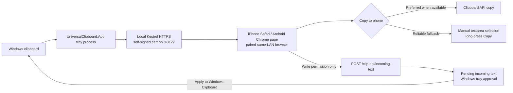

# Design: Windows to Mobile Clipboard Bridge

Generated by `/office-hours` on 2026-06-11
Branch: none
Repo: local workspace (not initialized as Git)
Status: APPROVED
Mode: Builder

## Problem Statement

Build a personal, open-source tool that moves copied plain text between a Windows
PC and a phone browser without using chat, email, or cloud notes. The supported
mobile browsers for the current release are iPhone Safari and Android Chrome.

The MVP flow is:

1. Copy text on Windows with `Ctrl+C`.
2. Open a previously paired local-network page on the phone.
3. See the three most recently shared items.
4. Tap the copy control.
5. Paste into another mobile app.

Write-enabled pairings also allow the phone page to submit plain text back to
Windows. Incoming text is never applied automatically; it appears as `Pending
incoming text` in the Windows tray and the user must choose `Apply to Windows
Clipboard`.

The first version is for one user on a trusted private Wi-Fi network. Pairing is
required before a browser can retrieve clipboard content.

## Architecture Sketch



## What Makes This Cool

The useful moment is not file transfer. It is making a small Windows-to-phone text
transfer feel nearly native: copy once, open one familiar page, tap once, paste.

The product is deliberately smaller than a synchronization service: no account, no
cloud database, no mobile app, and no application-managed clipboard archive on disk.

## Constraints

- Windows-to-phone sharing is the default path. Phone-to-Windows text submission is
  available only for Write-enabled pairings and requires Windows tray approval
  before touching the Windows clipboard.
- iPhone Safari and Android Chrome are the required mobile receivers for the current
  release.
- The MVP works only when both devices can reach each other on one trusted private
  network.
- Clipboard payloads are plain text only.
- Each item is limited to at most 1,048,576 UTF-8 bytes.
- Only the three most recent approved items are shared.
- Shared items and pending sensitive items exist only in process memory.
- The application never intentionally writes clipboard payloads to files, logs, or
  authorization storage. Windows may still place process memory in the pagefile,
  hibernation file, or a crash dump; this design cannot prevent that.
- Restarting the Windows app clears all shared and pending clipboard items.
- Shared items do not expire automatically. They leave the list when displaced by
  newer items or explicitly withdrawn on Windows.
- Every Read-capable paired browser can read all currently shared items.
- New pairings default to `Read only`. The Windows tray user must select `Write
  only` or `Read + Write` before generating a pairing code if the phone should be
  allowed to send text back to Windows.
- Incoming phone-to-Windows text is grouped by authorization ID and remains
  pending until the Windows tray user applies or discards it.
- Revoke-one, revoke-all, authorization expiry cleanup, and application exit clear
  the corresponding incoming text queue.
- Pairing duration choices are 1 hour, 5 hours, 1 day, 1 week, and permanent.
- Pairing authorization persists across Windows restarts; clipboard content does not.
- `Permanent` means no server-side expiry until revoked. The mobile browser may
  remove its cookie or site storage and require pairing again.
- The baseline mobile copy path is manual copy from visibly selected text. Direct
  one-tap copy is an opportunistic enhancement, not a release dependency.
- The MVP serves the local page over a persisted self-signed HTTPS certificate for
  the selected IPv4 address. The certificate is protected with current-user DPAPI
  and follows a trust-on-first-use model. This is not a full local trust model: it
  has no private CA installation or automatic browser certificate pinning, so it
  does not by itself defeat an active same-network first-use MITM. The compensating
  MVP controls are private-Wi-Fi scope, one-time pairing codes, host/IP-bound
  HttpOnly cookies, independent same-origin session proof headers, no CORS grant,
  rate limits, tray-visible HTTPS fingerprint, a deliberate reset action, and clear
  release notes that Ray must approve before local use.

## Premises

1. The MVP will be used only on a private Wi-Fi network the user trusts.
2. A paired local web page is enough to validate whether this workflow is better
   than sending messages or notes to oneself.
3. Safari or Chrome copy behavior may degrade to selecting the text and asking the
   user to choose `Copy`; the page must never claim confirmed success for an
   unverified copy.
4. Sensitive-text detection reduces accidental sharing but is not a password or
   data-loss-prevention system.
5. Keeping application-managed content in memory and limiting history to three items
   is sufficient for the MVP.
6. The Windows core will contain no HTTP or browser dependencies. A future cloud
   design may reuse capture, classification, approval, and history behavior, but
   reuse of authentication or transport code is explicitly not promised.

## Cross-Model Perspective

An independent cold review described the strongest version as a zero-account,
zero-cloud clipboard bridge, not a synchronization platform.

It recommended a Windows tray application, native clipboard events, an embedded web
server, a framework-free mobile page, one-time QR pairing, and simple polling. It
argued against adding local certificates, PWA support, mDNS, WebSockets, or a cloud
prototype to the MVP.

The opposing case identified five primary risks:

1. Local session credentials and clipboard content can still be intercepted or
   tampered with by an active same-network attacker during first-use certificate
   acceptance.
2. Safari one-tap copy may be unreliable if the local certificate is not trusted.
3. Sensitive-content rules can create false confidence.
4. Firewall, VPN, guest Wi-Fi, and client isolation can prevent LAN access.
5. Pairing, tray UI, clipboard events, and browser fallback can already exceed a
   weekend if the scope expands.

The conclusion was `GO WITH CHANGES`: keep the local-network MVP, state its trust
limits precisely, use single-use pairing codes, make manual copy reliable, and treat
scope control as a release requirement.

## Approaches Considered

### Approach A: Local Self-Signed HTTPS MVP

Use a Windows tray application with an embedded Kestrel HTTPS server backed by a
persisted self-signed certificate and a responsive, framework-free web page.

- Effort: Small
- Risk: Medium
- Completeness: 8/10
- Advantages:
  - Fastest path to a useful personal tool.
  - No mobile app, account, certificate profile, or hosted service.
  - The application does not upload clipboard content.
- Disadvantages:
  - Avoids passive LAN sniffing compared with cleartext HTTP.
  - Safari or Chrome may show a certificate warning because the certificate is
    self-signed.
  - The first certificate acceptance is not protected against an active same-network
    MITM because there is no private CA or automatic browser certificate pinning.
  - The mobile browser may require manual copy after text selection.
  - LAN routing and Windows Firewall can make setup unreliable.

### Approach B: Local HTTPS with a Private CA

Use the same application but generate a local certificate authority, install its root
certificate on the phone, and serve the page over HTTPS.

- Effort: Large
- Risk: High
- Completeness: 9/10
- Advantages:
  - Encrypts local traffic.
  - Provides a secure browser context for the standard Clipboard API.
- Disadvantages:
  - Certificate installation and trust configuration are disproportionate for a
    one-user MVP.
  - IP address and certificate-name changes create maintenance work.
  - Setup becomes harder than the workflow it replaces.

### Approach C: Fixed-Domain Cloud Relay

Use a hosted HTTPS site such as `clip.yourapp.com`. The Windows application uploads
encrypted snapshots and paired browsers retrieve and decrypt them.

- Effort: Extra large
- Risk: Medium
- Completeness: 10/10
- Advantages:
  - Stable URL, reliable HTTPS Clipboard API, and cross-network access.
  - Avoids LAN routing and firewall problems.
- Disadvantages:
  - Requires hosting, relay authentication, abuse controls, key management, and
    operational ownership.
  - Privacy requires end-to-end encryption; TLS alone would let the service read
    clipboard content.

## Recommended Approach

Build Approach A for the MVP: local Kestrel HTTPS with a persisted self-signed
TOFU certificate. Approach C is a future redesign, not code that will be prebuilt behind
speculative interfaces.

Use `.NET 10 LTS`, C#, WinForms, and an in-process ASP.NET Core Kestrel server. .NET
10 is the current active LTS release as of June 2026. Publish a self-contained
`win-x64` application.

### MVP Scope Lock

The following requested features remain in the MVP:

- three shared items;
- five authorization duration choices;
- multiple paired browsers;
- revoke one and revoke all;
- sensitive-content alert plus tray approval list;
- manual withdrawal of shared items.

To keep that scope viable:

- no mDNS or automatic discovery;
- no private CA, certificate-profile installation, or automatic browser certificate
  pinning;
- no PWA;
- no WebSocket or SSE;
- no cloud code;
- no automatic network repair;
- no image, file, or HTML transfer;
- no interactive notification actions. A notification alerts the user and opens the
  tray; approval happens in the tray window;
- no installer, code signing, or start-with-Windows option in the first release.

## Process and Threading Model

1. A current-user named mutex containing the Windows user SID enforces one
   application instance. The first instance also owns a current-user-only named pipe
   with the same SID-derived name. A second launch waits up to two seconds to send
   `ShowTray`, then exits. If the mutex exists but the pipe does not respond, it shows
   an error instead of starting a competing server. Simultaneous first launches are
   resolved by the atomic mutex acquisition.
2. `Main` runs as STA and owns the WinForms message loop, hidden clipboard window,
   tray icon, and clipboard reads.
3. Kestrel runs as an `IHost` in the same process. Request handlers execute on thread
   pool threads and never call WinForms controls directly.
4. Clipboard history is published as an immutable snapshot. Mutations occur under one
   short lock; readers obtain the current immutable snapshot atomically.
5. A single `AuthorizationCoordinator` serializes pairing, authorization expiry,
   revoke-one, revoke-all, and persistence mutations. Request authentication reads
   the latest immutable authorization snapshot.
6. Tray updates from non-UI code are posted through the captured WinForms
   `SynchronizationContext`.
7. Startup order is: acquire mutex and start the command pipe, load authorizations,
   select network interface,
   start Kestrel, register clipboard listener, show tray status.
8. Shutdown order is: unregister the clipboard listener; stop Kestrel from accepting
   new requests; wait up to five seconds for active handlers and authorization
   commands to finish; cancel remaining handlers and commands that have not started
   persistence; wait up to another two seconds for canceled handlers to exit; then
   clear shared and pending content. A command that has started atomic persistence is
   allowed to finish before the coordinator stops. If handlers still do not exit,
   the app records a content-free diagnostic and terminates without orderly memory
   clearing. Finally it disposes tray and pipe resources and releases the mutex.
   Authorization mutations are write-through, so shutdown is not relied on for
   durability.

## Windows Core

### Clipboard Monitor

- Registers a hidden WinForms window with `AddClipboardFormatListener`.
- Handles `WM_CLIPBOARDUPDATE` on the STA thread.
- Reads `UnicodeText` only.
- If the clipboard is busy, retries on the STA message loop after 25 ms, 50 ms, and
  100 ms; it does not sleep the UI thread.
- A value is empty only when `.Length == 0`; whitespace is valid content.
- The exact observed `.NET string` is compared with the immediately previous
  successfully retrieved string using ordinal comparison.
- An exact consecutive duplicate does not create another shared or pending item.
- Withdrawal does not reset duplicate tracking. Copying a different value and then
  copying the withdrawn value again creates a new item.
- Text is not trimmed, normalized, or given different line endings.
- A strict UTF-8 encoder counts bytes and rejects unpaired UTF-16 surrogates.
- Values above 1,048,576 bytes are rejected and produce a local notification.

Deduplication state transitions are normative:

| Event | Update previous observed value? | Create item? |
| --- | --- | --- |
| Clipboard cannot be read or has no Unicode text | No | No |
| Empty string | Yes | No |
| Invalid UTF-16 or over 1 MiB | Yes | No |
| Exact duplicate of previous observed value | No change | No |
| Normal accepted text | Yes | Shared item |
| Sensitive accepted text | Yes | Pending item |
| Pending item later allowed or discarded | No | Move or remove existing item |
| Shared item withdrawn or evicted | No | Remove existing item |

Therefore, re-copying rejected, discarded, withdrawn, or evicted text creates no new
item until the clipboard first changes to a different string.

### Sensitive Text Classifier

The classifier performs one bounded, linear-time scan and ships with only these
high-confidence MVP rules:

- PEM private-key blocks using the standard unencrypted, encrypted, RSA, EC, and
  OpenSSH header/footer marker pairs. The literal marker strings are intentionally
  not printed here so repository secret scanners do not treat this design document
  as containing a private key.
- GitHub classic tokens matching the `gh[pousr]_` token family and GitHub
  fine-grained personal access tokens using the `github_pat_` prefix.
- AWS access-key identifiers matching long-term `AKIA` and temporary `ASIA`
  access-key prefixes.

Both PEM markers must begin at the start of the text or immediately after `\n`.
After the final hyphen, each marker must be followed by `\r\n`, `\n`, or end of text.
The matching footer must occur after its header. Each rule uses non-backtracking or
direct span scanning, has positive, negative, boundary, and maximum-size test
vectors, and runs in linear time. A match means `possible sensitive content`, not
`confirmed secret`.

### Pending Approval Store

- Holds at most three candidates and at most 3 MiB total.
- A fourth candidate evicts the oldest candidate.
- An exact consecutive duplicate is already removed by the clipboard monitor.
- Candidates never enter shared history before approval.
- The tray provides `Allow once` and `Discard`.
- The notification contains only a rule label and masked preview. It does not contain
  the full clipboard text.
- Closing the application clears all candidates.

### Clipboard History

- Holds at most three approved immutable items in memory.
- Each item contains a 128-bit random ID, UTC timestamp, and exact text.
- Every process start creates a new random 128-bit `instanceId`.
- The history has an unsigned 64-bit `version`, initialized to zero.
- Adding, withdrawing, or evicting an item increments `version` once for the resulting
  snapshot.
- The polling identity is the pair `(instanceId, version)`, preventing a browser from
  confusing snapshots across Windows restarts.

## Authorization

### Pairing Code

- The user selects 1 hour, 5 hours, 1 day, 1 week, or permanent before generating a
  code. Five hours is selected by default.
- The user selects `Read only`, `Write only`, or `Read + Write` before generating a
  code. `Read only` is selected by default.
- The selected permissions are bound to the one-time pairing code on Windows.
  Mobile clients cannot request or escalate permissions during exchange.
- Only one unconsumed pairing code exists at a time. Generating another invalidates
  the previous code.
- The code contains 192 random bits encoded as base64url without padding.
- It expires after two minutes or one successful exchange.
- QR URL format: `https://<selected-ip>:43127/pair#code=<code>`.
- Pair-page JavaScript reads the fragment, immediately calls
  `history.replaceState(null, "", "/pair")`, then submits the code. If URL cleanup
  throws or the fragment is malformed, it does not submit. The mutable JavaScript
  variable holding the code is overwritten with an empty string in `finally`.
- Exchange atomically removes the matching code before issuing authorization. If
  issuance fails after consumption, the user must generate a new code.
- Pair requests are limited to 1 KiB, five attempts per minute per source address,
  and twenty attempts per minute process-wide.

The fragment prevents normal server access logs and referrer headers from containing
the code. It does not protect the code from an active same-network attacker during
first certificate acceptance, browser compromise, or the person viewing the QR code.

### Session Authorization

- A successful exchange creates a random 256-bit token.
- The server stores a random 128-bit authorization ID, the token's SHA-256 digest,
  browser label, optional device name, optional browser name, creation time, last
  access time, bound host IPv4 address, nullable server-side expiry, and permission
  flags.
- Digest comparison uses fixed-time comparison.
- The token is stored in a host-scoped `clip_session` cookie. The `Domain` attribute
  is omitted.
- Cookie attributes are `HttpOnly`, `Secure`, `SameSite=Strict`, and
  `Path=/clip-api`.
- Pair exchange also returns an independent random session proof. The browser keeps
  that proof in same-origin browser storage, preferring `localStorage` so mobile
  browser tab reloads keep the paired session alive and falling back to
  `sessionStorage` if persistent storage is unavailable. Requests send it as
  `X-Clip-Session`; the server stores only its digest with the authorization record
  and requires both the HttpOnly bearer cookie and this proof for clipboard reads.
  The proof is deliberately not the bearer token, so
  cookie-only requests, wrong proofs, replaying the cookie value as the proof, and
  proof-only requests are unauthorized.
- Cookies do not isolate TCP ports. A different same-host service that the browser
  accepts for that origin can receive the cookie for matching `/clip-api` paths. The
  unusual path reduces accidental exposure but does not remove same-host cookie
  scope risk.
- Expiring durations set matching `Max-Age` and server expiry.
- Permanent sets a far-future cookie expiry but has no server expiry. Browser
  retention is not guaranteed.
- Server-side expiry and revocation are authoritative even if the browser retains a
  cookie.
- `GET /clip-api/clips` requires `Read`. `POST /clip-api/incoming-text` requires
  `Write`; a valid read-only session receives `403` and its cookie is not cleared.
- Any `401` response also expires the cookie with `Max-Age=0`.
- `Revoke one` deletes one stable authorization ID. `Revoke all` clears the store.
- The tray lists paired devices with device name, browser, creation time, last
  access time, expiry or `Until revoked`, Read/Write permissions, and an
  authorization ID suffix beside each revoke action.
  It begins with eight base64url characters and extends in four-character increments
  until every displayed suffix is unique. Duplicate or blank labels are allowed
  because the full authorization ID is authoritative.
- A browser is identified only by its token and user-editable label. No
  fingerprinting is used.

### Authorization Mutation Transactions

- The `AuthorizationCoordinator` owns an immutable authorization snapshot and
  processes one command at a time through a single-reader queue.
- Each authorized feed request atomically acquires a lease for one authorization ID
  and holds it until its response body completes or is canceled. Acquisition checks
  token digest, expiry, revocation state, and that the record's bound IPv4 address
  equals the currently selected host address.
- Revocation first marks the target authorization or all authorizations as
  `revoking`, which prevents new leases. It then cancels and drains existing leases,
  writes the candidate snapshot, and only reports success after persistence and
  lease drainage both complete. Therefore, after revoke success is reported, no
  earlier request can still return clipboard content.
- Expiry prevents new leases immediately. Any active lease may finish only if it was
  acquired before expiry; the browser receives no guarantee that an in-flight
  response is canceled at the exact expiry instant.
- Pair exchange, revoke-one, and revoke-all construct a candidate snapshot, protect
  and atomically write it to disk, then publish it in memory.
- The application does not set a session cookie or report pairing success until the
  candidate snapshot is durable.
- The application does not report revocation success until the candidate snapshot is
  durable.
- If persistence fails because of disk, ACL, DPAPI, or replacement errors, the old
  snapshot remains active and the UI reports the operation failed.
- A pairing code is consumed before persistence begins. If persistence fails, the
  code remains consumed and the user generates another one.
- Expired records are rejected using their stored UTC expiry even before cleanup.
  Cleanup removal is processed through the same write-through queue.
- If a revoke persistence operation fails, the prior authorization snapshot becomes
  active again only after all old leases have drained; the UI reports failure.

### Authorization Persistence

- File path:
  `%LOCALAPPDATA%\UniversalClipboard\authorizations.v1.bin`.
- The complete serialized authorization metadata is encrypted using Windows DPAPI,
  `DataProtectionScope.CurrentUser`.
- The directory and file use current-user-only ACLs.
- Writes use a temporary file in the same directory, flush to disk, then atomic
  replace or move.
- The document has an explicit schema version.
- Schema version 3 stores optional device name, optional browser name, last-access
  time, and Read/Write permission flags. Legacy schema versions load as Read-only
  authorizations without device, browser, or last-access metadata.
- Unknown schema, truncated data, or DPAPI decryption failure fails closed: no saved
  token is accepted. The bad file is renamed with a `.corrupt` suffix and the tray
  requires re-pairing.
- The authorization file never contains clipboard text, masked previews, pairing
  codes, or plaintext session tokens.

## Local Network Delivery

### Interface and Port

- The fixed TCP port is `43127`.
- Eligible interfaces are operational Ethernet or Wi-Fi interfaces with a private
  IPv4 address and a default gateway. Loopback, tunnel, and interfaces without a
  gateway are excluded by default.
- If exactly one interface is eligible, it is selected automatically.
- If multiple interfaces are eligible, sharing remains paused until the user selects
  one in the tray.
- A user selection is retained by interface ID while that interface remains eligible
  and Private. The presence of additional eligible interfaces does not return a
  retained valid selection to `SelectionRequired`.
- Kestrel binds only to the selected IPv4 address and port.
- A port conflict disables sharing and displays the owning-port diagnostic; the app
  does not silently choose another origin.
- Network state is one of `NoEligibleInterface`, `SelectionRequired`,
  `PublicProfileBlocked`, `PortConflict`, `Starting`, or `Running`.
- State priority is: shutdown in progress, `NoEligibleInterface`,
  `PublicProfileBlocked`, `SelectionRequired`, `PortConflict`, `Starting`, then
  `Running`.
- One serialized `NetworkCoordinator` owns interface reevaluation and the complete
  stop-drain, authorization-revoke, bind, and start transition. Concurrent network
  change events are coalesced and reevaluated after the current transition.
- Loss of the selected interface immediately leaves `Running`, stops and drains the
  host, and invalidates active pairing codes.
- Re-evaluation with no eligible interface, multiple eligible interfaces, or a
  Public network enters the corresponding paused state, except that a retained valid
  interface selection resolves the multiple-interface case.
- Re-evaluation with exactly one eligible Private interface attempts `Starting`.
- Any selected IPv4 address change revokes all authorizations through the write-through
  coordinator before the host starts on the new address. Re-pairing is required. If
  revocation cannot be persisted, sharing remains paused.
- At process startup, after interface selection but before Kestrel starts, every
  persisted authorization whose bound IPv4 address differs from the selected address
  is removed through one write-through mutation. If that mutation fails, sharing
  remains paused. Every lease acquisition also checks the bound address, so a stale
  authorization is rejected even before cleanup completes.

### Windows Firewall

The first release does not modify Windows Firewall automatically.

Documentation provides one administrator PowerShell command that creates a TCP 43127
inbound rule restricted to the Private profile and LocalSubnet. The tray checks
whether the port is reachable locally and displays:

- selected interface and URL;
- network profile;
- port-listening state;
- firewall setup link.

The app never recommends enabling the rule for Public profiles. A local listening
check proves only that Kestrel is running. If the exact expected firewall rule cannot
be found, the tray reports firewall reachability as `Unknown - test from phone`,
not `Blocked` or `Allowed`.

### Web Host

- Static HTML, CSS, and JavaScript are embedded in the application.
- There are no external scripts, fonts, analytics, CDNs, or CORS endpoints.
- Requests whose `Host` header is not the selected IPv4 address and port `43127` are
  rejected with `400`.
- Clipboard state is read through the current immutable history snapshot. No unused
  cloud transport abstraction is introduced.
- Kestrel request-body limits are configured globally; pairing uses the stricter
  1 KiB limit.
- Logs contain route, status, duration, and coarse source address only. They never
  contain cookies, pairing codes, request bodies, or clipboard text.

## Mobile Page

- Polls at most once per second while visible.
- Stops polling when hidden.
- Renders text using `textContent`, never HTML interpolation.
- Shows newest item first, its relative time, and a copy control.
- A visible read-only `<textarea>` contains the exact selected item for the fallback
  path.
- On a button gesture:
  1. Try `navigator.clipboard.writeText`.
  2. Only a resolved promise displays `Copied`.
  3. If unavailable or rejected, select the complete textarea value.
  4. The optional legacy `execCommand("copy")` path may run, but its return value is
     not treated as confirmed clipboard state. The UI displays `Copy requested -
     verify, or long-press and choose Copy`.
- Manual selection is the normative fallback and must work even if all
  programmatic copy APIs fail.
- On `visibilitychange` to hidden, `pagehide`, `401`, or pairing-state transition,
  the page stops polling and removes clipboard text from the DOM.
- On `pageshow`, and always when `event.persisted` is true, the page renders no cached
  items until a fresh authorized request completes.
- The page includes a `Send to Windows` text area. It is disabled unless the current
  session proof has a stored `write` or `readWrite` permission from pairing.
- If `POST /clip-api/incoming-text` returns `403`, the page disables sending and
  tells the user to re-pair from Windows with Write enabled.
- A successful incoming send clears the mobile text area and reports only that text
  is pending in the Windows tray. The mobile page never claims to have changed the
  Windows clipboard.
- The design cannot prevent mobile OS app-switcher screenshots taken before the
  page clears.

The approved interaction sketch is in
[`docs/ux-wireframe.html`](./ux-wireframe.html).

## HTTPS Transport And HTTP Contract

The local listener serves the page and API over self-signed HTTPS on the selected
IPv4 address and TCP `43127`. HTTP below refers to HTTP semantics inside that HTTPS
transport, not cleartext HTTP.

The app persists one HTTPS identity per selected IPv4 address under
`%LOCALAPPDATA%\UniversalClipboard\https-certificates.v1.bin`, protected with
Windows DPAPI for the current user. Restarting the app on the same selected address
reuses the same self-signed certificate. The tray displays the SHA-256 fingerprint,
a short code, and certificate expiry. `Reset HTTPS` deletes the persisted identity,
revokes pairings, invalidates any pairing code, and restarts sharing with a new
certificate when sharing was running.

If the HTTPS identity is created while persisted authorizations already exist, or a
stored identity is replaced because it is corrupt, expired, or bound to the wrong
selected IPv4 address, the host revokes existing authorizations before Kestrel
starts serving with the replacement certificate. If that revocation cannot be
persisted, sharing remains paused in the authorization-persistence-failed state.

All JSON uses UTF-8 and `Content-Type: application/json`. Every static and API
response uses `Cache-Control: no-store, max-age=0`, `Pragma: no-cache`,
`Content-Security-Policy: default-src 'self'; script-src 'self'; style-src 'self';
connect-src 'self'; img-src 'self' data:; object-src 'none'; base-uri 'none';
frame-ancestors 'none'`, `Referrer-Policy: no-referrer`, and
`X-Content-Type-Options: nosniff`. A `204` response carries the same headers and no
body.

Expected errors use:

```json
{
  "error": {
    "code": "pairing_failed",
    "message": "Pairing failed. Generate a new code on Windows."
  }
}
```

Status conventions:

- `200`: successful pairing or changed clipboard snapshot;
- `204`: authorized clipboard snapshot is unchanged;
- `400`: malformed input, invalid query, or invalid `Host`;
- `401`: missing, expired, revoked, or failed pairing authorization;
- `403`: authenticated route lacks the required permission;
- `404`: unknown route;
- `405`: route exists but HTTP method is not allowed;
- `415`: pairing or incoming text request is not `application/json`;
- `413`: request too large;
- `429`: rate limit exceeded;
- `500`: unexpected error with no internal details.

Authentication failures use `unauthorized`. All pairing-code failures use
`pairing_failed`; they do not distinguish missing, expired, reused, or concurrently
consumed codes. Any `401` that receives `clip_session` clears it with
`Path=/clip-api; Max-Age=0`.

All expected API errors use the JSON schema above, including framework-level errors.
The error-code mapping is:

| Status | Code |
| --- | --- |
| 400 | `invalid_request` |
| 401 from pairing | `pairing_failed` |
| 401 from protected routes | `unauthorized` |
| 403 | `forbidden` |
| 404 | `not_found` |
| 405 | `method_not_allowed` |
| 413 | `request_too_large` |
| 415 | `unsupported_media_type` |
| 429 | `rate_limited` |
| 500 | `internal_error` |

Static-file misses may use an empty `404`; API routes never return framework HTML
error pages. `Allow` is present on `405`, and `Retry-After` is present on `429`.

### `POST /clip-api/pair/exchange`

Request, maximum 1 KiB:

```json
{
  "code": "base64url-value",
  "label": "My Pixel",
  "deviceName": "Android",
  "browserName": "Chrome"
}
```

The label, device name, and browser name are optional, trimmed to 64 Unicode scalar
values, and stored only as authorization metadata. Permission is not accepted in
this request; the Windows-generated pairing code already carries it. Unknown JSON
properties, a missing code, malformed base64url, invalid label or metadata, or body
other than a JSON object returns `400`.

A successful durable authorization sets the cookie, returns `200`, and returns:

```json
{
  "authorized": true,
  "authorizationId": "base64url-value",
  "expiresAt": "2026-06-12T01:00:00Z",
  "sessionProof": "base64url-value",
  "permission": "read",
  "deviceName": "Android",
  "browserName": "Chrome"
}
```

`expiresAt` is `null` for permanent authorization. Failed, expired, reused, or
concurrently consumed codes return `401` without revealing which condition occurred.
Persistence failure returns `500`, sets no cookie, and leaves the pairing code
consumed.

### `GET /clip-api/clips`

Query parameters:

- `instance`: optional 128-bit base64url process instance ID;
- `since`: optional unsigned 64-bit decimal version.

Initial requests omit both parameters. The parameters must either both be omitted or
both be valid. Malformed base64url, an out-of-range version, or only one supplied
parameter returns `400`. If `instance` differs from the running instance, the server
returns the full current snapshot regardless of `since`.

Changed response:

```json
{
  "instanceId": "base64url-value",
  "version": 7,
  "items": [
    {
      "id": "base64url-value",
      "copiedAt": "2026-06-11T12:00:00Z",
      "text": "exact clipboard text"
    }
  ]
}
```

The changed snapshot response returns `200`. If `instance` matches and `since`
equals the current version, return `204`. A `since` value greater than the current
version returns `200` with the current snapshot. The endpoint is rate-limited to two
requests per second per authorization. The endpoint requires `Read`.

Withdrawal and authorization revocation are Windows-local actions.

### `POST /clip-api/incoming-text`

Request:

```json
{
  "text": "exact text from the phone"
}
```

The endpoint requires `Write`. A valid read-only session returns `403 forbidden`
without clearing the cookie. Missing, expired, revoked, or invalid sessions return
`401 unauthorized` and clear the cookie when present. Text must be non-empty, valid
UTF-16, and no more than 1,048,576 UTF-8 bytes.

Success returns:

```json
{
  "accepted": true,
  "incomingId": "base64url-value"
}
```

Success only means the text is pending in the Windows tray. It does not mean the
Windows clipboard changed.

## Data Lifecycle

1. Windows receives a clipboard-change event.
2. Empty, duplicate, unsupported, invalid-UTF-16, or over-limit content is ignored or
   rejected as specified.
3. Sensitive classification runs before shared history changes.
4. A normal item immediately enters the three-item memory history.
5. A sensitive candidate enters the bounded pending store.
6. `Allow once` moves it into shared history; `Discard` removes it.
7. Adding a fourth shared item removes the oldest as part of the same version change.
8. Withdrawing an item removes it and increments the snapshot version.
9. Write-enabled phone text enters the incoming queue grouped by authorization ID.
10. `Apply to Windows Clipboard` writes one queued incoming item to the Windows
    clipboard and removes it. `Discard incoming` removes it without writing.
11. Authorization revoke, revoke-all, expiry cleanup, and app exit clear the matching
    incoming queue items.
12. Closing the application destroys shared, pending, incoming, and pairing-code
    content.
13. DPAPI-protected authorization metadata remains until expiry or revocation.
14. Pairing and revocation become externally successful only after authorization
    persistence succeeds.

## Security Model

The MVP defends against casual unauthorized browsing, stale or reused pairing links,
accidental sharing of a few recognizable secret formats, browser caching, and
application-managed persistence of clipboard history.

It does not defend against:

- a malicious device on the same network that can attack the first-use self-signed
  HTTPS certificate acceptance flow before TOFU continuity exists;
- malware or another local process with access to the Windows clipboard, process
  memory, or user profile;
- Windows paging, hibernation, or crash-dump capture;
- a missed sensitive-data pattern;
- a compromised paired browser session;
- iOS app-switcher screenshots;
- denial of service from the local network.

Security-related UI uses precise wording:

- `Pairing required` is allowed.
- `Private`, `encrypted`, or `secure transfer` is not allowed for Approach A.
- Sensitive detection says `Possible sensitive content detected`.
- Phone-to-Windows sending says `Pending incoming text`; it must not say the
  Windows clipboard changed until the tray user clicks `Apply to Windows Clipboard`.
- Permanent pairing carries a high-risk warning and is not the default.
- Five hours is the default duration.

## Failure States

- No eligible LAN interface: sharing stays paused.
- Multiple eligible interfaces: user selects one.
- Windows network profile is Public: warn and do not recommend a firewall exception.
- Port 43127 is occupied: sharing stays disabled until the conflict is resolved.
- Firewall blocked: show the URL and focused setup instructions.
- Phone cannot connect: suggest checking same Wi-Fi, guest/client isolation, VPN,
  selected adapter, and Windows Firewall.
- Pairing code expired or was consumed: generate a new QR code.
- Session expired or revoked: clear the DOM and return to pairing.
- Authorization file cannot be decrypted: fail closed and re-pair.
- Clipboard remains busy after three retries: ignore the event and show a diagnostic
  count, without exposing content.
- Text is invalid UTF-16 or exceeds 1 MiB: do not share it and notify locally.
- Browser copy failed: select the full textarea and show manual-copy instructions.
- Read-only session posts incoming text: return `403`, keep the authorization active,
  and tell the user to re-pair with Write enabled.
- Write-only session polls the Windows feed: return `403` without clearing the
  cookie, and render an empty feed while `Send to Windows` remains available.

## Success Criteria

The MVP is complete only when all of these are true:

1. After copying ordinary text on Windows, a paired visible iPhone Safari or Android
   Chrome page displays it within two seconds under normal LAN conditions.
2. The page shows at most three items in newest-first order.
3. Closing and reopening the Windows app produces an empty feed with a different
   `instanceId`.
4. An unpaired, expired, or revoked browser cannot retrieve clipboard content.
5. A pairing code works once, cannot succeed in concurrent double exchange, and
   expires within two minutes.
6. Session tokens and pairing codes never appear in server URLs or logs.
7. Withdrawing an item removes it from the phone on the next visible poll.
8. Safari or Chrome either confirms standard Clipboard API success or visibly
   selects the exact text and instructs the user how to copy; failure is never
   silent.
9. PEM private keys, GitHub-style tokens, and AWS access-key identifiers are withheld
   until explicitly approved on Windows.
10. Inputs at 1,048,575 and 1,048,576 UTF-8 bytes are accepted; 1,048,577 bytes and
    unpaired surrogates are rejected without freezing either interface.
11. All five requested authorization durations work, including server-side
    until-revoked behavior for permanent authorization.
12. A clean Windows machine can reach first successful pairing and transfer within
    ten minutes using documented firewall setup.
13. A successful revoke remains revoked after forced process termination and restart;
    a failed persistence operation reports failure and leaves the prior authorization
    state unchanged.
14. After revoke success is displayed, no request using that authorization, including
    one that began earlier, can subsequently return clipboard content.
15. Restarting on a different selected IPv4 address durably removes stale
    authorizations before the server accepts requests.
16. New pairings default to `Read only`; mobile clients cannot escalate permissions
    during exchange.
17. Read-only sessions can fetch clips but cannot post incoming text; Write-enabled
    sessions can enqueue incoming text, and Windows clipboard writes happen only
    after `Apply to Windows Clipboard`.
18. Revoke, revoke-all, expiry cleanup, and app exit clear the relevant incoming
    queues.

## Verification Plan

### Unit Tests

- history eviction, exact deduplication, withdrawal, instance ID, and version changes;
- every row of the normative deduplication state table, including rejected,
  discarded, withdrawn, and evicted text followed by same-value and different-value
  copies;
- pairing entropy, expiry, atomic double exchange, token hashing, fixed-time compare,
  all duration choices, bound permissions, and revocation;
- authorization-coordinator ordering, Read/Write lease gating, last-access metadata,
  and concurrent validate/revoke behavior;
- DPAPI authorization serialization round trip, schema v3 metadata, legacy schema
  fallback, schema mismatch, truncation, decryption failure, disk-full/write
  failure, and atomic replacement failure;
- DPAPI HTTPS identity persistence, per-IPv4 separation, corrupt-file quarantine,
  expiry regeneration, SAN mismatch regeneration, current-user ACLs, and reset;
- UTF-8 sizes 1,048,575, 1,048,576, and 1,048,577 bytes, astral characters, line
  endings, whitespace-only text, and unpaired surrogates;
- classifier positive, negative, boundary, large-input, and false-positive cases;
- pending-store count and byte eviction.

### Integration Tests

- initial feed, unchanged feed, changed feed, and process-instance mismatch;
- unauthorized, expired, revoked, and corrupt-persistence startup;
- pairing request limits, metadata validation, rate limits, and concurrent exchange;
- Read-only, Write-only, and Read+Write authorization behavior for `/clip-api/clips`
  and `/clip-api/incoming-text`;
- pairing persistence failure before response and revocation durability after forced
  termination;
- revoke success racing with an already-authorized `GET`, asserting that success is
  withheld until the leased response completes or is canceled and that no response
  completes afterward;
- cookie attributes, `/clip-api` path, cookie clearing on `401`, and documented
  cross-port cookie behavior;
- request size limits, wrong method, wrong media type, and every documented JSON
  status/code mapping;
- missing `Host`, wrong host, and correct host with wrong port;
- cache, CSP, referrer, and content-type headers;
- Kestrel startup, fixed-port collision, active request during shutdown, and bounded
  shutdown;
- absence of clipboard text, pairing codes, tokens, and masked previews in logs.

### Manual Windows Matrix

- simultaneous single-instance launch, command-pipe signaling, pipe timeout, and
  unresponsive existing process;
- clipboard contention;
- notification and tray approval;
- permission selector default, QR invalidation when permission changes, incoming
  queue masking, `Apply to Windows Clipboard`, and `Discard incoming`;
- restart clearing with authorization retained;
- revoke one, revoke all, expiry cleanup, and app exit clearing matching incoming
  queue items;
- no interface, one interface, multiple interfaces, DHCP address change, VPN present,
  Public profile, firewall blocked, and occupied port;
- shutdown while network change and active feed requests are in progress;
- restart on a different IP after the prior process stopped before observing the
  network change, asserting persisted authorizations are durably revoked before bind;
- corrupt authorization file, DPAPI failure, write failure, and concurrent revoke
  while feed requests are active.

### Manual Mobile Browser Matrix

- current supported iOS Safari and one previous major iOS version when available;
- current Android Chrome, including Chrome user-agent reporting in the Windows tray;
- first pairing, every duration, expiry, revocation, and browser cookie deletion;
- Read-only pairing with disabled `Send to Windows`;
- Write-only pairing with no Windows feed and enabled `Send to Windows`;
- Read+Write pairing with both `Copy to iPhone` and `Send to Windows`;
- incoming text accepted in Safari or Chrome, shown as pending in the Windows tray,
  applied only after tray approval, and discarded without writing when requested;
- polling latency, Unicode preservation, maximum-size payload rendering;
- standard copy success, legacy request state, and manual copy;
- hidden/visible transitions, bfcache back navigation, pair-page back navigation,
  failed `replaceState`, refresh, and app switching;
- Android Chrome backgrounding or tab restoration after pairing, verifying
  `Copy to iPhone` and `Send to Windows` still work without re-pairing while the
  server-side authorization remains valid;
- malformed fragments and failed fragment cleanup, asserting that no exchange request
  is sent and the code variable is cleared;
- a controlled same-IP second-port page demonstrating the documented same-host
  cookie port-isolation limitation.

## Distribution Plan

The repository will use an OSI-approved license and GitHub.

For the first release:

- GitHub Actions builds and tests on Windows.
- Release artifacts contain a self-contained `win-x64` portable application and
  SHA-256 checksum.
- Setup documentation includes the exact administrator firewall command, network
  limitations, pairing, duration and permission semantics, self-signed HTTPS
  warning, TOFU identity reset behavior, incoming-text approval, Safari fallback,
  and Android Chrome bidirectional support.
- Code signing and an installer are deferred. Documentation warns that an unsigned
  build may trigger Windows SmartScreen.

After the workflow proves useful, distribution may move to a signed installer. A
future cloud version requires a separate design covering end-to-end encryption,
identity, relay authentication, recovery, abuse controls, retention, and deletion.

## Next Steps

1. Record five real Windows-to-phone transfers and use them as manual fixtures.
2. Initialize the repository and create the `.NET 10` WinForms solution.
3. Implement the single-instance process and memory-only clipboard pipeline.
4. Implement the local web host against a synthetic fixture snapshot in a test
   harness and verify manual copying. Production clipboard routes remain pairing
   gated.
5. Add one-time pairing, all duration choices, DPAPI persistence, and revocation.
6. Add Safari and Chrome polling, instance/version handling, and manual-copy
   behavior.
7. Add bounded sensitive approval and the tray management UI.
8. Run the full matrix on a clean Windows environment, a real iPhone, and a real
   Android Chrome device.

## The Assignment

Before public release, record at least five real Windows-to-phone text transfers
over one normal day: source application, approximate text size, whether the content
was sensitive, and where it was pasted. These examples become the first manual test
set. Implementation may begin earlier because the user explicitly approved immediate
Subagent-Driven Development on 2026-06-11; observations must not be invented.

## What I Noticed About How You Think

- You reduced the native-level goal to a paired web workflow when implementation cost
  was too high.
- You made pairing part of the MVP instead of postponing access control.
- You expanded history from one item to three only after identifying withdrawal and
  sensitive-content needs, while keeping content memory-only.
- You selected the local HTTP approach for the MVP and treated the fixed-domain cloud
  service as a later, separate security design.

## References

- [.NET support policy](https://dotnet.microsoft.com/en-us/platform/support/policy/dotnet-core)
- [Windows `AddClipboardFormatListener`](https://learn.microsoft.com/en-us/windows/win32/api/winuser/nf-winuser-addclipboardformatlistener)
- [WebKit Async Clipboard API](https://webkit.org/blog/10855/async-clipboard-api/)
- [MDN secure contexts](https://developer.mozilla.org/en-US/docs/Web/Security/Defenses/Secure_Contexts)
- [MDN deprecated `execCommand`](https://developer.mozilla.org/en-US/docs/Web/API/Document/execCommand)
- [Microsoft DPAPI `ProtectedData`](https://learn.microsoft.com/en-us/dotnet/api/system.security.cryptography.protecteddata)
- [LocalSend](https://github.com/localsend/localsend)
- [PairDrop](https://github.com/schlagmichdoch/PairDrop)
